  

# ✈️ Awesome Airport Operations Management Ecosystem 🏢

  
  
  
  

> 📌 A curated directory of top **Airport Operations Management Systems (AOMS)**, **SaaS platforms**, **Airport Operational Databases (AODB)**, **Flight Information Display Systems (FIDS)**, and **Open-Source Aviation GitHub Projects**. Focused on airport resource optimization, airside management, passenger flow analytics, ground handling, turnaround tracking, and Collaborative Decision-Making (A-CDM).

🗓️ **Last updated: March 2026**

---

## 📑 Table of Contents

- [📊 Industry Market Overview](#-industry-market-overview)
- [💼 SaaS & Hosted Airport Operations Platforms](#-saas--hosted-airport-operations-platforms)
- [🔓 Open-Source GitHub Projects](#-open-source-github-projects)
- [🧩 Key Airport Operations Functional Modules](#-key-airport-operations-functional-modules)
- [🤝 How to Contribute](#-how-to-contribute)
- [⚖️ Disclaimer & Regulatory Compliance](#%EF%B8%8F-disclaimer--regulatory-compliance)
- [💖 Support & Sponsoring](#-support--sponsoring)
- [📈 Star History](#-star-history)

---

## 📊 Industry Market Overview

> 💡 **Market Intelligence:** The global Airport Operations Management market is estimated at **$4.8 Billion (2026)** with a compound annual growth rate (CAGR) of 7.8%. The market is **moderately fragmented**, dominated by legacy aviation technology leaders (Amadeus, SITA, ADB Safegate) while experiencing rapid innovation and market share expansion from modern cloud-native SaaS providers (such as AeroCloud and Veovo).

---

## 💼 SaaS & Hosted Airport Operations Platforms

Below is a comparative breakdown of leading enterprise SaaS and hosted platforms for airport operational database (AODB) management, resource allocation, and passenger flow management, sorted by **Company Size / Valuation / Annual Revenue (Descending)** 📉.

| 🏢 Platform & Description | 💰 Company Size / Valuation / Revenue | 🏷️ Specific Starting Pricing | ⏱️ Free Tier / Trial Limits |
| :--- | :--- | :--- | :--- |
| **[Amadeus Airport Operational Database](https://amadeus.com/en/airports)** End-to-end airport operational database (AODB), flight schedule management, gate allocation, and passenger processing suite. | **$24.5 Billion** Valuation *(€6.52B / $7.1B Annual Revenue)* | **$5,000 / month** starting base operational module fee (or $0.05–$0.15 per passenger processed) | **No Free Plan** *(30-Day Sandbox API evaluation trial with 1,000 test requests upon enterprise request)* |
| **[SITA Airport Management](https://www.sita.aero/solutions/sita-airport-management/)** Integrated airport management platform covering real-time flight tracking, apron resource planning, and A-CDM coordination. | **$1.71 Billion** Annual Revenue *(Aviation Industry Cooperative owned by 400+ members)* | **$10,000 / month** starting base platform license for regional airports | **No Free Plan** *(30-Day developer API trial access via developer.aero portal)* |
| **[ADB Safegate](https://www.adbsafegate.com/)** Airfield management, automated docking guidance systems (A-VDGS), apron management, and airside operational intelligence. | **$1.79 Billion** PE Valuation *(~$500 Million Annual Revenue)* | **$15,000 / module** installation & software license (+ annual maintenance fee) | **No Free Plan** *(14-Day interactive sandbox proof-of-concept for qualified airfield operators)* |
| **[INFORM Airport (GroundStar)](https://www.inform-software.com/)** AI-driven turnaround management, ground handling workforce optimization, and dynamic apron resource scheduling. | **$130 Million** Annual Revenue | **$1,500 / month** per operational module (e.g., Turnaround Management / Staff Rostering) | **No Free Plan** *(30-Day proof-of-concept environment using synthetic flight datasets)* |
| **[Veovo](https://www.veovo.com/)** Intelligent airport software for passenger flow prediction, queue analytics, asset management, and situational awareness. | **$30 Million** Annual Revenue | **$2,500 / month** starting tier based on annual airport passenger volume | **No Free Plan** *(14-Day guided product demonstration and pilot environment)* |
| **[RESA Airport Suite](https://www.resa.aero/)** Comprehensive airport management covering aeronautical billing, passenger check-in (CUSS/DCS), and FIDS for regional hubs. | **$20 Million** Annual Revenue | **$2,000 / month** core module subscription for regional & international hubs | **No Free Plan** *(14-Day live evaluation instance for airport authority teams)* |
| **[GateKeeper Systems](https://www.gatekeepersystems.com/)** Ground transportation management, commercial vehicle curb tracking (RFID/LPR), and FAA Part 139 airfield inspection logging. | **$12 Million** Annual Revenue | **$1,200 / month** starting per airport module (e.g., Commercial Vehicle / App-139) | **No Free Plan** *(30-Day free trial on cloud modules with up to 5 user accounts)* |
| **[Damarel FiNDnet](https://www.damarel.com/)** Ground handling operational suite, turn management, service recording, and automated flight billing for airports and handlers. | **$8.0 Million** Annual Revenue | **$1,000 / month** per station base pricing for regional airports & ground handlers | **No Free Plan** *(14-Day cloud evaluation trial supporting up to 50 simulated flights)* |
| **[AeroCloud](https://www.aerocloud.aero/)** Cloud-native, AI-powered airport operations platform featuring automated flight management, FIDS, and gate allocation with zero per-user licensing fees. | **$8.1 Million** Annual Revenue *( $20.6 Million Total VC Funding )* | **$1,000 / month** starting per module (unlimited user seats included) | **No Free Plan** *(30-Day risk-free proof-of-concept trial deployment for qualified regional airports)* |
| **[Amorph Systems](https://www.amorph-systems.com/)** Real-time airport operational modeling, passenger queue forecasting, and terminal flow digital twin simulation. | **$5.0 Million** Annual Revenue | **$1,500 / month** starting for terminal flow analytics & digital twin module | **No Free Plan** *(14-Day cloud simulation sandbox with up to 2 terminal floorplans)* |

---

## 🔓 Open-Source GitHub Projects

Explore production-grade open-source software, air traffic control (ATC) simulators, ADS-B radar displays, and database models, sorted by **GitHub Stars_Count (Descending)** ⭐.

1. **[tar1090](https://github.com/wiedehopf/tar1090)**   
   🛰️ High-performance web interface for viewing ADS-B / Mode-S air traffic data. Features custom map layers, history playback, and multi-receiver aggregation.

2. **[dump1090](https://github.com/flightaware/dump1090)**   
   📻 A simple Mode S decoder for RTLSDR devices developed by FlightAware. Standard tool for receiving and processing live ADS-B aircraft positions near airports.

3. **[OpenScope](https://github.com/openscope/openscope)**   
   🖥️ Web-based Air Traffic Control (ATC) simulator built in JavaScript. Allows users to command arrivals, departures, and ground movements across realistic terminal radar approach controls (TRACON).

4. **[BlueSky ATM Simulator](https://github.com/TUDelft-CNS-ATM/bluesky)**   
   🎓 Open-source Air Traffic Management (ATM) simulator developed by TU Delft. Built for research in conflict detection, resolution algorithms, and trajectory optimization.

5. **[OpenSky Network API](https://github.com/openskynetwork/opensky-api)**   
   🌐 Official Python and Java bindings for the OpenSky Network API. Provides programmatic access to real-time air traffic vector states, flight histories, and airport arrivals/departures.

6. **[skies-adsb](https://github.com/machineinteractive/skies-adsb)**   
   📡 Real-time 3D air traffic display using unfiltered ADS-B data from RTL-SDR receivers. Deployable on Raspberry Pi with custom 3D WebGL map layers and aircraft photo integration via FlightAware / Planespotters.

7. **[airpyrt-tools](https://github.com/x56/airpyrt-tools)**   
   🐍 Python client and library interface for managing network devices and operational hardware across airport infrastructure environments.

8. **[Flight Management System](https://github.com/sanchit2107/Flight-Management-System)**   
   💻 Full-stack web application built with Spring Boot and Angular for managing flight schedules, routes, aircraft allocations, and airport operations data.

9. **[ATC Reinforcement Learning](https://github.com/fvalka/atc-reinforcement-learning)**   
   🤖 Reinforcement learning environment built on OpenAI Gym for training AI agents to solve air traffic control vectoring and collision avoidance challenges.

10. **[Airport Management System Database Design](https://github.com/patilankita79/Airport-Management-System-Database-Design)**   
    🗄️ Comprehensive relational database design implemented in Oracle SQL covering flight scheduling, passenger check-ins, employee assignments, and gate allocations.

11. **[Airport DBMS](https://github.com/tusharnankani/Airport-DBMS)**   
    📊 Complete airport database management system modeling passenger ticketing, flight status updates, terminal infrastructure, and staff duties.

12. **[Flight Schedule Optimization](https://github.com/monu808/Flight-Schedule-Optimization)**   
    🧠 AI-powered Streamlit & Python application designed to optimize flight schedules, forecast cascade delay impacts, and optimize runway throughput using machine learning.

13. **[Airport Database Management System](https://github.com/Jana-Ahmed-20005/Airport-database-managment-system)**   
    🔑 Integrated airport management application supporting role-based access for passengers, flight crews, ground staff, and security personnel.

14. **[Application SMA pour le contrôle aérien](https://github.com/amine-sabbahi/Application-SMA-pour-le-controle-aerien)**   
    🕹️ Multi-Agent System (MAS) built with JADE and JavaFX to simulate interactions between aircraft, pilots, air traffic managers, and airside controllers.

15. **[RealtimeFlightDisplay](https://github.com/SathvikCookie/RealtimeFlightDisplay)**   
    📱 Compact ESP32 display solution showing live airport arrivals and departure schedules using the OpenSky Network API on 3.5" touchscreens.

16. **[Airport Traffic Control Simulator](https://github.com/Henrique-Versiani/Airport-Traffic-Control)**   
    ⚙️ C-based multithreaded simulation (using PThreads) enforcing deadlock detection, aging-based starvation prevention, and gate/runway allocation logic.

17. **[Airport Database Management System (SQL)](https://github.com/poetabdullah/Airport-Database-Management-System)**   
    📜 Microsoft SQL Server + Django database platform managing fueling schedules, baggage tracking, aircraft maintenance, and security clearance roles.

18. **[Radar ATC](https://github.com/Luffy0805/radar_atc)**   
    🎮 Luanti (Minetest) mod for air traffic surveillance, runway configuration, NOTAM publishing, and interactive tower radio communications.

19. **[Airport Manager Microservices](https://gitlab.fi.muni.cz/xnadzam/airport-manager)**   
    🧱 Maven multi-module Spring Boot project modeling airport microservices for flights, aircraft availability, crew assignments, and passenger processing.

20. **[SOCFAI Framework](https://www.socfai.com/)**  
    ⚡ ITEA open-source AI platform providing real-time airport operational dashboards, predictive baggage analytics, passenger movement tracking, and energy management.

21. **[Mercury Mobility Platform](https://www.mercury-project.eu/)**  
    🚀 Agent-based simulation engine developed by University of Westminster to evaluate air traffic management, passenger door-to-door mobility, and ECAC airspace policies.

---

## 🧩 Key Airport Operations Functional Modules

When evaluating airport management software, solutions generally encompass the following operational verticals:

- **🗃️ Airport Operational Database (AODB):** Central repository for master flight schedules, seasonal plans, real-time flight updates, and operational status messages (SSIM, AIDX, IATA messages).
- **🤝 Airport Collaborative Decision-Making (A-CDM):** Platform standard (promoted by EUROCONTROL and ICAO) to improve airport operational efficiency by sharing timestamps (TOBT, TSAT, TTOT) between airport operators, ground handlers, and air navigation service providers (ANSPs).
- **📅 Resource Management System (RMS):** Automated fixed-resource allocation algorithms for passenger gates, stands, baggage carousels, check-in counters, and de-icing pads.
- **📺 Flight Information Display System (FIDS):** Multi-screen public information displays located across passenger departure/arrival halls, gate areas, and baggage belts.
- **⏱️ Turnaround & Apron Management:** Real-time tracking of aircraft ground turnaround steps (offloading, fueling, catering, cleaning, loading) to ensure on-time departure (OTP).

---

## 🤝 How to Contribute

1. 🍴 Fork this repository.
2. 📝 Add your SaaS product or Open-Source project to `README.md` maintaining table/sorting order conventions.
3. 🔎 Ensure descriptions are factual, neutral, and include active website/repo links.
4. 🚀 Submit a Pull Request with a clear summary of additions.

---

## ⚖️ Disclaimer & Regulatory Compliance

This directory is community-curated for informational and research purposes. Airport operations systems handling live passenger processing, airfield operations, or ATC data must strictly comply with regional civil aviation regulations, including:
- 📜 **ICAO Annex 14** (Aerodromes)
- ✈️ **EASA / FAA Certification Guidelines**
- 🔄 **IATA AIDX Data Exchange Standards**
- 🔒 **ISO 27001 & Cyber Security Directives**

---

## 💖 Support & Sponsoring

If you find this curated directory helpful for your research, project, or organization, please consider supporting the project:

- ⭐ **Star** this repository on GitHub to help others discover it!
- 🔀 **Fork** and contribute new SaaS platforms or open-source projects.
- 📢 **Share** this list with aviation colleagues, developers, and researchers.
- ☕ **Sponsor / Buy a Coffee:** Support ongoing maintenance via [GitHub Sponsors](https://github.com/sponsors/ishandutta2007).

---

## 📈 Star History

---

*Made with ❤️ for airport operators, ground handlers, aviation authorities, systems integrators, and software engineers.*
